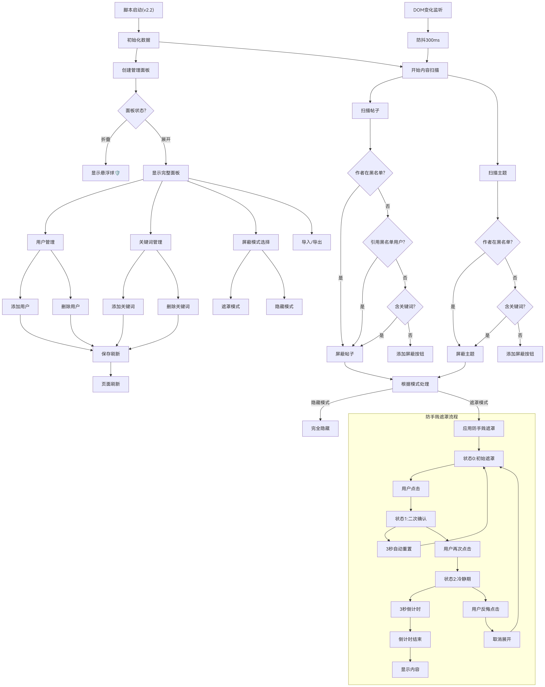
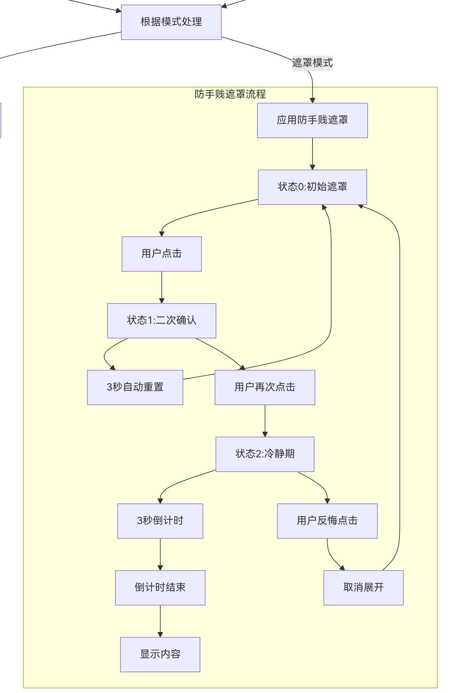

# Mirror chromaso Forum Block Pro (v2.2 深度强化版)

一个专为 **M 系镜像论坛（mirror.chromaso.net）** 打造的深度屏蔽扩展脚本。不仅能过滤不想看的人，更能守护你的冲浪心情。

---

## ✨ v2.2 核心特性

- 🚫 **深度引用屏蔽**：不仅屏蔽该用户的发言，连同**引用了该用户的楼层**以及**被该用户引用**的内容一并拦截，彻底切断负面信息流。
- 🛡️ **双重屏蔽机制**：
  - **用户屏蔽**：在用户名旁一键拉黑作者。
  - **屏蔽词过滤**：自定义屏蔽词（XP、引战、雷点），标题或内容命中即自动处理。
- 🎭 **屏蔽模式切换**：
  - **隐藏模式**：内容完全消失，不留痕迹。
  - **遮罩模式**：保留骨架并提示屏蔽原因，支持交互式查看。
- 🧘 **冷静期决策系统 (Anti-Impulse)**：
  - **二次确认**：点击展开时触发红色预警，防止好奇心导致的“手滑”。
  - **3秒倒计时**：进入蓝色的“冷静加载期”，并伴有温馨心理提示。
  - **主体化反悔机制**：在倒计时结束前，提供醒目的 **(点击此处反悔)** 按钮，给理智留出退路。

- 📌 **全功能管理面板**：支持分类管理、折叠显示以及配置的一键导入/导出。

---

## 🛠️ 安装方法

1. **安装插件**：首先在浏览器安装 [Tampermonkey](https://www.tampermonkey.net/) 或 [Violentmonkey](https://violentmonkey.github.io/)。
2. **安装脚本**：点击下方链接进入安装页面：
   - [GreasyFork 安装页面 v2.2](https://greasyfork.org/zh-CN/scripts/561604) (暂时还是2.1)
3. **开始使用**：刷新论坛页面，右上角会出现 “🛡️” 盾牌图标。

---

## 📌 使用说明

### 1. 屏蔽操作
* **用户**：在楼层作者名旁点击 `🚫 屏蔽`。
* **关键词**：点击面板 -> 切换到 `屏蔽词` 标签 -> 输入内容并点击 `+`。

### 2. 管理与保存
* 面板内点击红色 `×` 移除屏蔽项。
* **注意**：修改设置后需点击 `保存刷新` 按钮使配置生效。

### 3. 冷静期逻辑
当您在遮罩模式下点击查看时：
1. **第一击**：变红提醒，3秒不操作会自动重置（防止误触）。
2. **第二击**：进入倒计时。此时您可以阅读提示语，若决定不看，直接点击蓝色的反悔区域即可。

---

## 🗺️ 程序逻辑流程图 (System Logic Flow)

脚本核心处理逻辑如下：
 

冷静期/防手贱心灵保护遮罩流程图：
 

## 🖼️ 实现效果预览

- **屏蔽词管理面板**
  

- **冷静期加载与反悔机制**
  

---

## 📜 License
本项目采用 [MIT License](LICENSE) 开源，允许自由修改和分发。

---
**💡 提示**：良好的社区环境需要大家共同维护，建议合理使用屏蔽功能，减少负面能量的接触。
