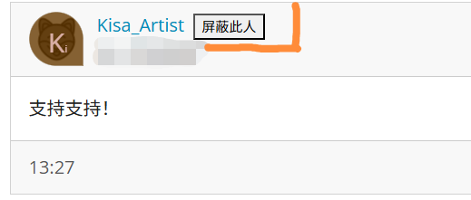
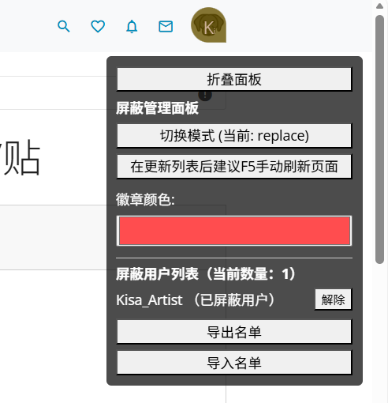
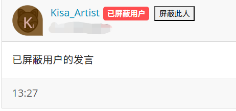
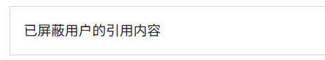

# Mirror Forum Block by Username (Final Fixed Version)

一个用于 **M 系镜像论坛（mirror.chromaso.net）** 的用户脚本，帮助你更好地管理浏览体验，彻底屏蔽不想看到的用户发言与帖子。

## ✨ 功能特性
- 🔒 **屏蔽指定用户：**在用户名旁边显示“屏蔽此人”按钮，一键加入屏蔽名单。
- 🧩 **双层屏蔽：**支持在 **楼层（发言内容）** 和 **帖子（主题帖）** 两个层面进行屏蔽，全面屏蔽目标用户的发言。
- 👀 **替换/隐藏模式：**可选择完全隐藏内容，或替换为提示文本。
- 🎨 **徽章标签：**屏蔽用户会显示“已屏蔽用户”徽章，颜色可自定义。
- 📌 **浮动面板：**右上角始终可见的管理面板，可折叠，支持模式切换与名单管理。
- 📑 **屏蔽名单管理：**查看、解除屏蔽用户，支持导入/导出名单，方便跨设备迁移。
- 📝 **引用屏蔽：**当别人引用被屏蔽用户的内容时，也会自动屏蔽。

## 🛠️ 安装方法
1. 安装浏览器扩展：
   - [Tampermonkey](https://www.tampermonkey.net/) 或 [Violentmonkey](https://violentmonkey.github.io/)
2. 点击安装脚本：
   - [GreasyFork 安装页面](https://greasyfork.org/zh-CN/scripts/561585-m%E7%B3%BB%E9%95%9C%E5%83%8F%E7%AB%99%E6%89%A9%E5%B1%95-%E5%B1%8F%E8%94%BD%E5%8A%9F%E8%83%BD-%E9%80%9A%E8%BF%87%E7%94%A8%E6%88%B7%E5%90%8D-mirror-chromaso-forum-block-by-username-fixed-version)
3. 打开论坛页面，即可使用。

## 📌 使用说明
- 在用户名旁边点击“屏蔽此人”即可加入屏蔽名单。  
- 支持在 **楼层和帖子两个层面**屏蔽用户的发言，彻底清理不想看到的内容。  
- 右上角浮动面板可切换模式、调整徽章颜色、管理名单。  
- 导出名单可保存为 JSON，导入时粘贴即可恢复。  

## 🖼️ 实现效果
- **屏蔽按钮示例：**  
  

- **浮动面板示例：**  
  

- **屏蔽后的楼层效果：**  
  

- **屏蔽引用后效果：**  
  

  ## 📌 后续更新计划v2.0

  1. 关键词屏蔽 (Keyword Blocking)
目前脚本只针对“人”，但很多时候用户是因为反感某些“话题”才想屏蔽。

功能描述：在面板中增加一个“屏蔽词”列表（如：不喜欢的XP, 政治, 引战）。如果帖子标题或内容包含这些词，直接屏蔽。
轻量化实现
  2. “点击查看”开关 (Toggle Reveal)
目前的“替换模式”会将内容替换为“已屏蔽用户的发言”，用户如果突然好奇想看一眼，必须去面板里解除屏蔽，非常麻烦。

功能描述：在“替换模式”下，将提示语变成一个可点击的按钮（例如：[已屏蔽用户的发言 - 点击临时查看]）。
  3 优化UI 使其更加美观
时间待定...近期

## 📜 License
本项目采用 [MIT License](LICENSE) 开源，允许自由修改和分发。
